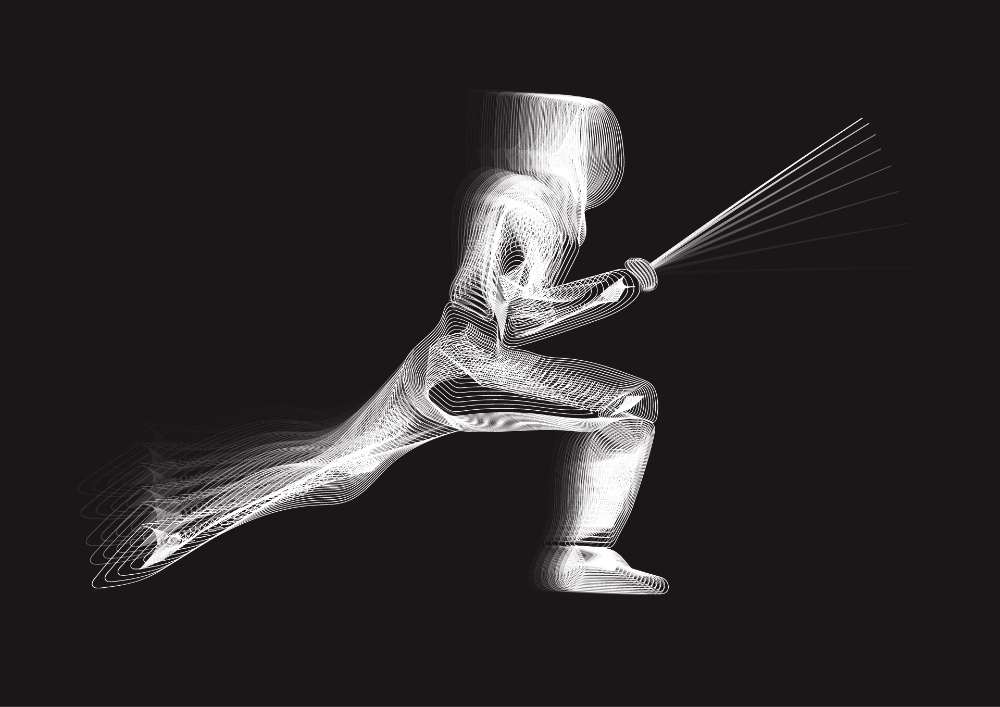
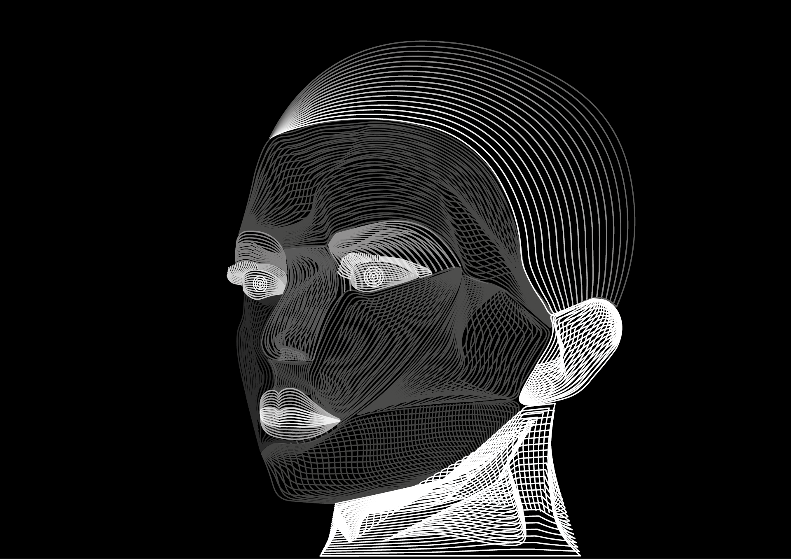

## Impression

### created by Ronald Steiniger
 
 
### I love digital art and these two are my own. 
### Notes
- It all started because of pc games, I was huge fun of digital art and compositions there.
- I attended art school in addition to elementary school and high school.
- I participated in various team projects where we presented works of art as children.
- Over time, I also got to University where I apply all my experience in practice .
PS. I still love to play pc games 
[homepage](https://github.com/RonaldRonno/english-for-designers/blob/main/README.md)
